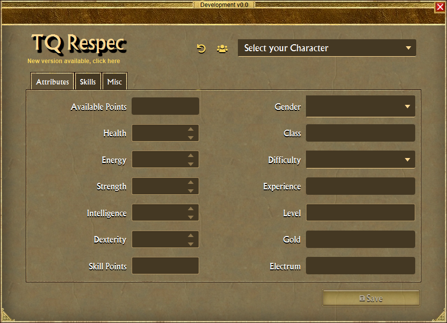
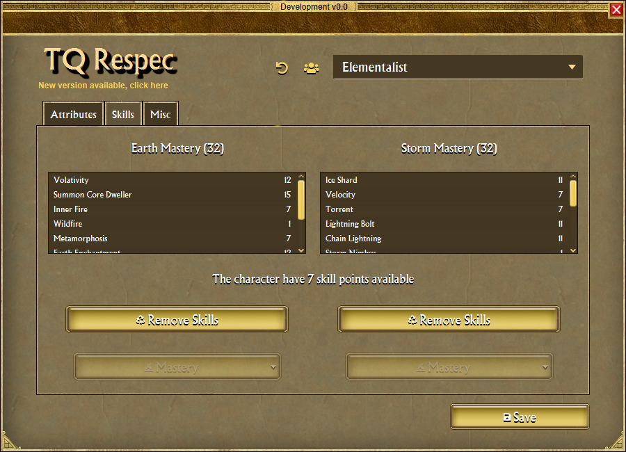
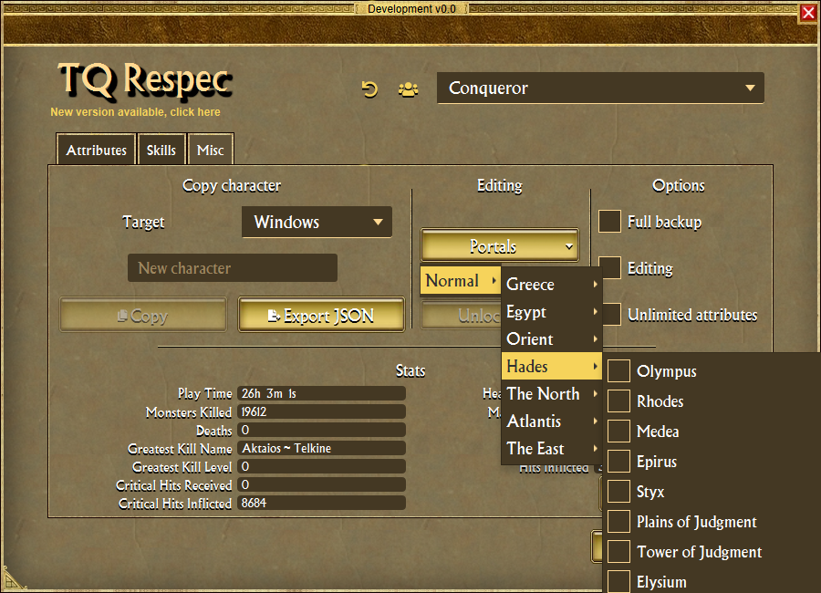
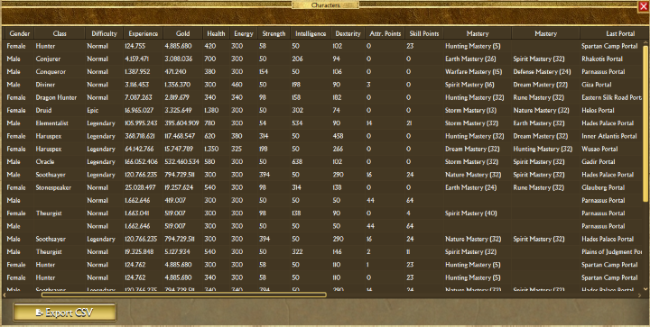

# TQ Respec

## Introduction

TQRespec is a tool for [Titan Quest](https://titanquestgame.com) game that helps you to change your character at any time. While this tool permits you make changes not available in game, cheating features are not available.

#### ***Download***

You can download TQRespec from the releases page, [here](https://github.com/epinter/tqrespec/releases/latest). There's no installation, just extract and run.

#### ***Requirements***

This software requires **Microsoft Windows (64-bit recommended)**. You don't need to have java or any other software installed, but if you have problems like missing dlls, check if you have Microsoft Visual C++ Redist 2015-2019 installed.

## **How to use**

#### ***Before you start***

Keep in mind that this software make modifications to your save game (more specifically the file Player.chr). You shouldn't modify your characters while the game is running, you can corrupt your save game. ***YOU SHOULD ALWAYS KEEP A FULL BACKUP OF YOUR SAVE GAME FOLDER*** (Documents/My Games/Titan Quest - Immortal Throne).

#### ***Running without the game installed***

This application uses game data. If you want to run it on a PC that doesn't have the game installed, make sure you have a 'gamedata' directory with Database and Text resources inside it. The structure should look like this:

~~~
TQRespec/app
TQRespec/runtime
TQRespec/gamedata/Database
TQRespec/gamedata/Text
TQRespec/TQRespec.exe
~~~

Where Database and Text folders (with its contents) are copied from the game.
The savegame needs to be at the same location as the game uses (Documents/My Games/...).

#### ***Use it!***

Select the character you want to change. Now you can see some information like Class and Difficulty, and start to change your savegame.

#### ***Attributes***

There are five attributes available to change (Health, Energy, Strength, Intelligence, Dexterity). When you decrease an attribute, you will see the number in "Available Points" increasing, and when you increase an attribute the points are automatically got from "Available Points". The number that increases in each of the attribute fields follows in game rules. In fact, you can't give more points to your character, just redistribute. So no cheat.

#### ***Skills***

Now if you change to Skills tab, you will see two lists with the skills of your character. Below these lists, there are two buttons for each. The first button "Reclaim All Skills Points" will remove all points allocated on skills on that mastery and make the points available to use in game. The button "Mastery" permits you to reduce the mastery level to 1 or remove the mastery completely.

If you have a mastery on level 24 and 7 skills with points allocated, you can click on "Reclaim All Skills Points" to have the points from the 7 skills back to you. Then you click on "Mastery / Reclaim" to have 23 points back from the mastery, so you will have the mastery with just 1 point allocated, or you can click on "Mastery / Remove" to have all 24 points from mastery.

#### ***Characters list and stats***

When you click on the button near the character selection list, you will be able to see a table with all your characters, with attributes and stats. There's also an option to export the table to CSV.

#### ***Android support***

Characters from "Titan Quest: Legendary Edition" are supported, can be respeced or copied/converted. TQRespec is unable to access the savegames directly on mobile, so you will always have to copy from mobile and copy again to device when finished. The savegame directory can be copied from Android device to savedata directory in the same directory as TQRespec.exe, the structure is like this:

~~~
TQRespec/app
TQRespec/runtime
TQRespec/savedata/__save1
TQRespec/savedata/_CharacterFromWindowsVersion
TQRespec/TQRespec.exe
~~~

The characters are normally stored at Android/data/com.hg.titanquestedition/files/Preferences/SaveData/Main. The name of each savegame is "__save" and followed by a number, this number is the saveId.

***IMPORTANT***: The game files (database and text) are ALWAYS needed. See above "Running without the game installed" to know where to copy the files. At this moment, the Android version is compatible with PC version. While (AT THIS MOMENT) there's no problem using a database from one platform on a savegame from another, we don't know when the compatibility will break. So is recommended to use Android database/text with Android savegame, and Windows database/text with Windows savegame.
TQRespec will not block using PC files with mobile savegame, but will alert. And will block the usage of mobile database with PC savegames. The stash (additional storage) will not be supported, conversion and copy of mobile savegames completely ignores the stash. All items stored in the character are kept.

The old mobile version of the game will not be supported.

#### ***IOS support***

The IOS version of the game is untested and unsupported at this time. If you want to use with IOS, open an issue and contribute testing, sending logs and feedback.

#### ***Copy your character***

If you want to change the name of you character, in the Misc tab you can type the new name in the "New character" text field, select the target platform then click on "Copy" button. A new character will be created, with progress, inventory with all items, attributes, skills, etc...

There are three targets available for selection: Windows, Android and Backup:
* The Windows target will make the new savegame compatible with Windows version of TQ, converting if necessary (when you are copying a mobile savegame to windows).
* The Android target will make a zip file with the savegame prepared to run on Android device, converted if necessary. Differently from Windows version, the savegame directory is different from player name inside the game. TQRespec generates a random number for the save-id, although very unlikely it's not impossible a save-id generated is already present on your device, if this happens you can just copy again. Some data is not copied, see "Android Support" for details. 
* The Backup target will make a zip file with the savegame. If you type a new name, it will be renamed before save. In the case of a mobile savegame, the save-id will be changed before save too.

#### ***Saving and backup***

After you finish, you can click on Save. At this moment, TQRespec will make a backup of the file "Player.chr" inside a .zip in the folder "Titan Quest - Immortal Throne/SaveData/TQRespec Backup". The file "Player.chr" is where the games saves everything about the character, except the progress, transfer area and storage.

#### ***Multi-language support***

All the languages available in-game are supported. Some interface strings can't be reused, so you will see some strings in your language and others in english if nobody contributed with a translation for your language. See [Translators](#translators) for a list of languages.

## ***Project and source code***

TQRespec is developed in Java language, using OpenJFX to provide graphical user interface, and a few more other open source dependencies. The current version is built using OpenJDK 14.
The software was made to work in Microsoft Windows operating system, since the game runs only in Windows. But because Java is multi-platform, this project is prepared to allow you to develop and test under Linux. To do so, you will need to have this structure inside the project (./gamedata):
~~~
gamedata/SaveData/Main/_savegame/Player.chr
gamedata/Database/database.arz
gamedata/Text/Text_EN.arc
~~~

#### ***Building***

Before building it, you need to have OpenJFX(JavaFX) SDK inside the ./sdk subdirectory. A repository with the needed files can be found [here](https://github.com/epinter/openjfx-sdk). Just clone it inside sdk directory.

With JDK 14 installed, you can build executing the 'clean' and 'build' gradle tasks with the command:

~~~
gradlew clean
gradlew build
~~~

#### ***Running the development version***

With this repository and openjfx-sdk properly in place, you can run with:

~~~
gradlew run
~~~

## **Troubleshooting**

#### ***Startup***
This software can fail to start if the game is not detected. Game is detected searching for Uninstall information from Windows, and data from your Steam installation. If you can't start, get the error message inside the "Show details" and open an issue. Or maybe you can find some help in the discussion at Steam Guides.
If your game path is not detected, you still can run TQRespec copying the game data, to do so follow the instructions [Running without the game installed](https://github.com/epinter/tqrespec#running-without-the-game-installed).

#### ***Errors and reporting***
If you see an error popup while using TQRespec, click on "Show details" and copy the complete error message (called java Exception). With this exception, a developer can find exactly where the code failed. If the software is crashing and you don't get an error message, or is crashing during startup, go to Windows Explorer and find the log file called **tqrespec.log** inside the directory %TEMP%. The %TEMP% is the windows temporary directory for you user.

#### ***Debug log***
If you need debug logs, you need to run the application with command line parameters:
The number is the level of debugging, from 1 to 9:

Lower level of debugging messages sent to log:
~~~
TQRespec.exe --debug=1
~~~ 

More debug for GUI and player save parsing, and basic level for database parsing:
~~~
TQRespec.exe --debug=3
~~~ 

Higher level of debug for GUI, player save and database parsing.
~~~
TQRespec.exe --debug=5
~~~ 

Higher level of debug for the application and all libraries:
~~~
TQRespec.exe --debug=9
~~~ 

## **Contribution**

### ***Translators***
* Portuguese Brazil (pt-BR): ***Emerson Pinter***
* Russian (ru): ***Evgeniy Chefranov (titanquest.org.ua)***
* Ukrainian (uk): ***Evgeniy Chefranov (titanquest.org.ua)***
* Italian (it): ***Loris Gabriele***

### ***Note***
Contributions are always welcome. They will be accepted or rejected depending on the scope and predefined objectives of the project. Look at the open [issues](https://github.com/epinter/tqrespec/issues) and milestones to know how you can help. Feel free to open an issue and suggest a feature you want to see available.